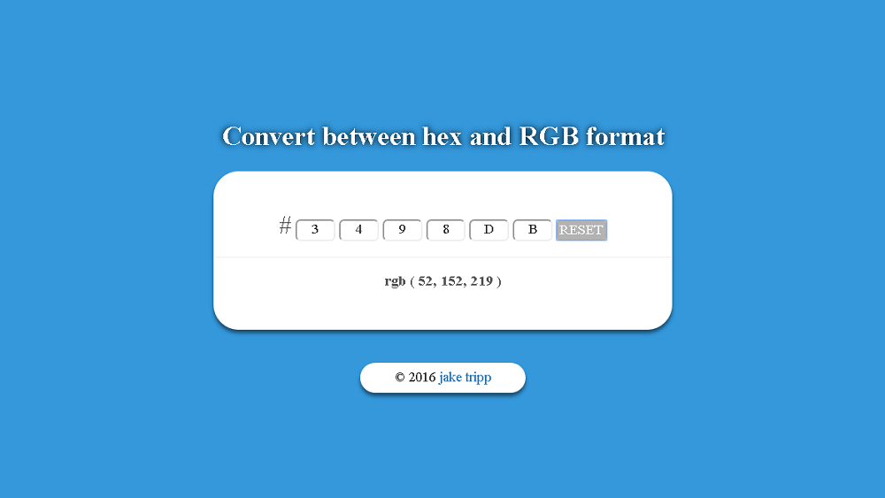

#Color Conversion
#### Written with JavaScriptm, HTML, CSS, Bootstrap, & jQuery.

You can checkout Color Conversion [here](https://jaketripp.github.io/Color-Conversion/ "Color Conversion"). Next time you find yourself with an aching desire to understand how to convert from hexadecimal to RGB, head on over to this website!   

- - - - 

### Features:
* Takes a hexadecimal number as input and returns and RGB value

* Dynamically updates the RGB value

* Dynamically changes background color

* Utilizes subtle techniques to enhance UX (autotabs, autohighlights, can be used without a mouse, etc)

- - - - 

### Screenshots:

- - - - 
